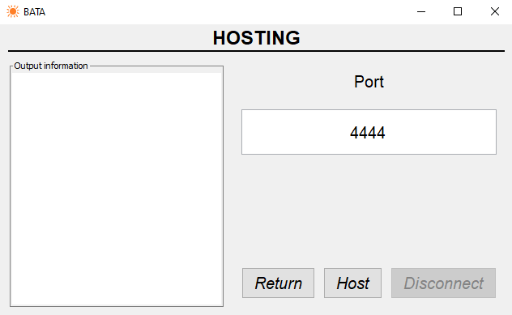
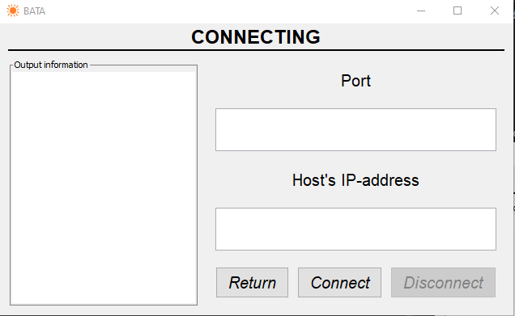

# BATA
The Basic Audio Transmitting Application.\
A voice chat within the LAN, written in pure java.

## Why?
This project was made as an experiment. So don't take it seriously! :)\
I was needed the tool to talk with my brother in the other room. Using heavy programs wasn't the solution I wanted, so I created my own voice chat.
#### Here's some pros that moved me to make this:
- Lightweight: uses around 30 Kb of space (jar) and under the 100 Mb of RAM
- Easy-to-use: no unnecessary things like account, just a chat
- No internet dependency: works within a LAN

## How do I use it?
### 1. HOST
Click `HOST` button, enter any available (in your LAN) Port at the corresponding `Port` text area, and then click `Host`

### 2. CONNECT
Click `CONNECT` button, enter Port at `Port` and host's address at `Address` text areas, then click `Connect`

### 3. Return
Return button simply moves you back to main screen, **disconnects you and clears the output information area**

### 4. Disconnecting
When disconnecting, please wait till the `X: N socket closed` messages appear at the output information area

## Drawbacks
 - You can't choose what microphone or what speakers to use
 - It only supports one-to-one connection, meaning there's no group voice chat
 - Requires JRE (for systems other than Windows)

## Architecture
Connection is made using UDP. Currently, for sending and receiving signal DatagramSocket and DatagramPacket classes are used. And the DataLine classes are used to process audio. For GUI swing was used.

## Roadmap
- [x] GUI
- [x] Mute button
- [ ] Input gain changing
- [ ] Ability to choose I/O devices
- [ ] Different localizations
- [ ] Text Chat
- [ ] Multi-user connection